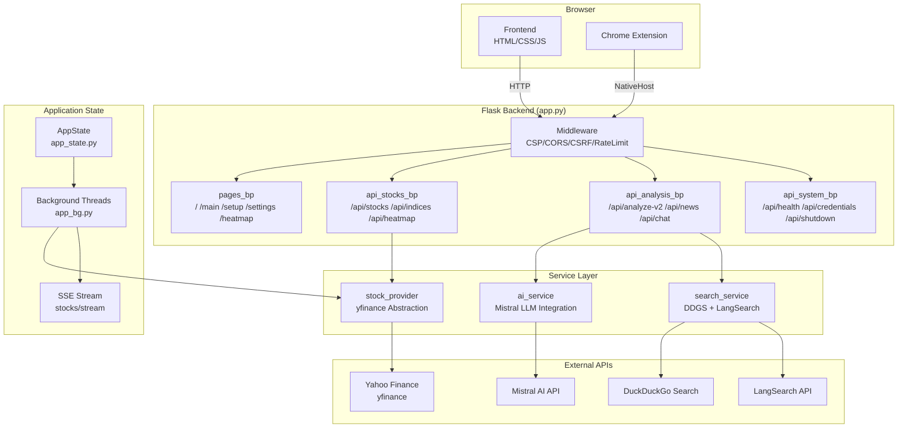
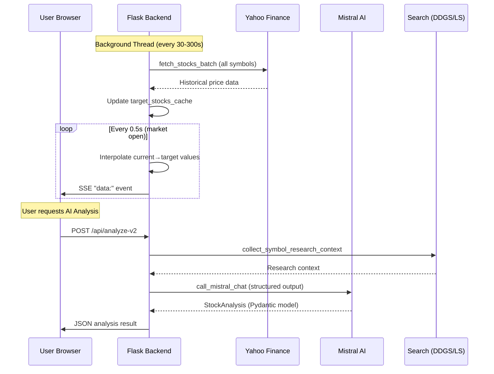
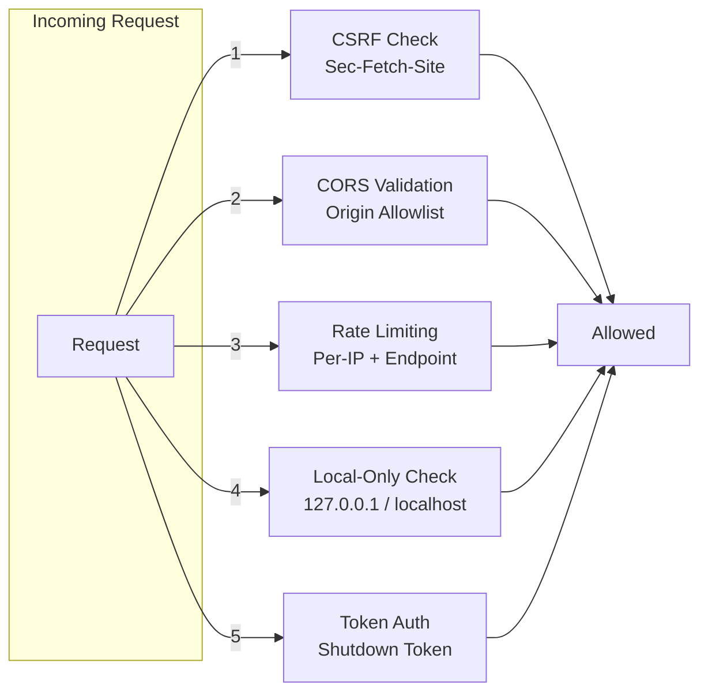

# Architecture Overview

## System Architecture

## Data Flow

## Module Structure

| Module              | Responsibility                                                         |
| ------------------- | ---------------------------------------------------------------------- |
| `app.py`            | Flask app init, middleware, error handlers, blueprint registration     |
| `app_state.py`      | Centralized state: AppState, AIState, MarketDataState, CacheState, SSE |
| `app_helpers.py`    | Validation, caching, stock payload building, market hours              |
| `app_bg.py`         | Background threads: yfinance fetch loop, SSE interpolation loop        |
| `config_utils.py`   | Config file I/O, API key encryption (keyring/DPAPI)                    |
| `constants.py`      | Single source of truth for all tunable parameters                      |
| `route_helpers.py`  | Rate limiting, API key extraction, cache helpers                       |
| `error_codes.py`    | ErrorCode enum with ja/en messages                                     |
| `routes/`           | Blueprint route handlers (pages, stocks, analysis, system)             |
| `services/`         | External service integrations (AI, search, stock provider)             |
| `utils/`            | Validators, formatters, env helpers                                    |
| `static/js/`        | Frontend JavaScript (SSE, charts, UI, API client)                      |
| `templates/`        | Jinja2 HTML templates                                                  |
| `chrome_extension/` | Chrome/Edge extension (MV3)                                            |
| `native_host/`      | Windows native messaging host                                          |

## Security Model

## Key Design Decisions

1. **Personal Use First**: Designed for local/localhost use, not multi-tenant SaaS
2. **Graceful Degradation**: LangSearch → DDGS fallback, cached data when rate-limited
3. **Structured Outputs**: Mistral Pydantic models for reliable JSON generation
4. **SSE for Real-time**: Server-Sent Events with heartbeat and automatic reconnection
5. **Encrypted Credentials**: keyring > DPAPI (plaintext fallback removed)
