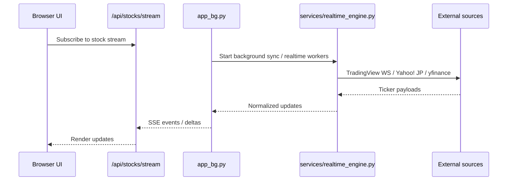

# Architecture Overview

## System Overview

```mermaid
graph TB
    subgraph Browser["Browser"]
        UI[HTML / CSS / JS]
        EXT[Chrome / Edge Extension]
        RTC[realtime_client.js]
    end

    subgraph FlaskApp["Flask Application"]
        APP[app.py\nApp factory + bootstrap]
        PAGES[pages_bp\n/ /setup /main /heatmap /screener /settings /experimental/orbit]
        SYS[api_system_bp\n/api/credentials /api/health /api/cache-stats /api/metrics /api/csrf-token /api/csp-report /api/shutdown]
        STOCKS[api_stocks_bp\n/api/indices /api/stocks /api/search /api/screener /api/heatmap /api/stocks/stream/ticket /api/stocks/stream /api/ai-portfolio* (GET /, POST /generate /rebalance /save /copy-to-my, DELETE /custom)]
        ANALYSIS[api_analysis_bp\n/api/trending /api/chat /api/news /api/analyze-v2 /api/ai-technical-lines]
    end

    subgraph Services["Service Layer"]
        AI[ai_service\nMistral chat / analysis helpers]
        SEARCH[search_service\nDDGS / LangSearch / Tavily]
        NEWS[news_service + news_formatter]
        STOCK[stock_service + stock_provider]
        RT[realtime_engine\nTradingView / Yahoo! JP]
    end

    subgraph State["Application State"]
        AS[app_state.py]
        BG[app_bg.py\nBackground threads / SSE sync]
    end

    subgraph External["External Sources"]
        MISTRAL[Mistral API]
        DDGS[DuckDuckGo Search]
        LS[LangSearch API]
        TAVILY[Tavily]
        YF[yfinance / Yahoo Finance]
        TV[TradingView WebSocket]
        YJP[Yahoo! Finance JP]
    end

    UI -->|HTTP| APP
    RTC -->|SSE| STOCKS
    EXT -->|Native host / HTTP| APP

    APP --> PAGES
    APP --> SYS
    APP --> STOCKS
    APP --> ANALYSIS

    ANALYSIS --> AI
    ANALYSIS --> SEARCH
    ANALYSIS --> NEWS
    STOCKS --> STOCK
    STOCKS --> RT
    BG --> STOCK
    BG --> RT
    AS --> BG

    AI --> MISTRAL
    SEARCH --> DDGS
    SEARCH --> LS
    SEARCH --> TAVILY
    STOCK --> YF
    RT --> TV
    RT --> YJP
```

## Request Flow

1. `app.py` で Flask アプリを生成し、セキュリティ、ログ、リクエストフック、ブループリントを登録します。
2. ページ表示は `routes/pages.py` が担当し、テンプレートに安全な設定値とデフォルト銘柄を注入します。
3. API リクエストは `routes/api_system.py`、`routes/api_stocks.py`、`routes/api_analysis.py` に分岐します。
4. 重い取得処理は `services/` に委譲され、キャッシュと状態は `app_state.py` と `app_bg.py` が調停します。
5. フロントエンドは通常の HTTP に加えて `/api/stocks/stream` から SSE を購読します。

## API Surface

| Group             | Main Responsibilities                                                       |
| ----------------- | --------------------------------------------------------------------------- |
| `pages_bp`        | 設定、メイン、ヒートマップ、スクリーナー、実験的観測所（Orbit）の HTML 配信 |
| `api_system_bp`   | credentials、health、cache stats、metrics、GET csrf-token、CSP report、shutdown |
| `api_stocks_bp`   | 銘柄一覧、検索、詳細、履歴、ヒートマップ、ポートフォリオ、SSE stream/ticket、AIポートフォリオ(GET /、POST /generate /rebalance /save /copy-to-my、DELETE /custom) |
| `api_analysis_bp` | trending、chat、news、analyze-v2、ai-technical-lines                        |

## Realtime Data Path

```mermaid
sequenceDiagram
    participant UI as Browser UI
    participant SSE as /api/stocks/stream
    participant BG as app_bg.py
    participant RT as services/realtime_engine.py
    participant SRC as External sources

    UI->>SSE: Subscribe to stock stream
    BG->>RT: Start background sync / realtime workers
    RT->>SRC: TradingView WS / Yahoo! JP / yfinance
    SRC-->>RT: Ticker payloads
    RT-->>BG: Normalized updates
    BG-->>SSE: SSE events / deltas
    SSE-->>UI: Render updates
```

## Frontend Entry Points

| File                               | Role                                              |
| ---------------------------------- | ------------------------------------------------- |
| `static/js/index_main.js`          | メインダッシュボード初期化                        |
| `static/js/realtime_client.js`     | リアルタイム更新描画（SSE購読は api.js に一元化） |
| `static/js/tradingview_manager.js` | TradingView 系 UI 連携                            |
| `static/js/api_client.js`          | API 呼び出し共通層                                |
| `static/js/setup.js`               | 初期設定画面                                      |
| `static/js/settings.js`            | 設定画面                                          |
| `static/js/screener.js`            | スクリーナー画面                                  |
| `static/js/heatmap.js`             | ヒートマップ画面                                  |
| `static/js/config_init.js`         | 起動時設定初期化                                  |

## Security Model

```mermaid
graph LR
    R[Incoming request] --> CSRF[CSRF / trusted state-changing request]
    R --> ORIGIN[Origin / local-origin checks]
    R --> RATE[Rate limit]
    R --> ADMIN[Admin token when configured (local or remote)]
    R --> SHUTDOWN[One-time shutdown token]
```

### Notes

- ローカル利用を前提に、危険な操作は複数の防御層で止めます。
- `MNS_ALLOW_REMOTE_API=1` は `MNS_ADMIN_TOKEN` とセットでのみ許可されます。
- `MNS_ADMIN_TOKEN` が設定されている場合（リモート/ローカルを問わず）すべての保護 API が
  `X-MNS-Admin-Token` ヘッダーを要求するため、ブラウザ UI はトークン未設定時のみ利用できます。
  / When `MNS_ADMIN_TOKEN` is set, every protected API requires the
  `X-MNS-Admin-Token` header regardless of deployment mode, so the first-party
  browser UI is usable only with the token unset.
- `api_credentials` は CSRF 除外されていません。保存・削除は通常の state-changing request として扱います。
- `api_shutdown` は native host 由来の単回トークンを必要とします。

## Module Map

| File                          | Responsibility                                                 |
| ----------------------------- | -------------------------------------------------------------- |
| `app.py`                      | アプリ生成、bootstrap、信号/終了処理、blueprint 登録           |
| `app_bg.py`                   | バックグラウンド同期、leader election、yfinance 収集、SSE 補完 |
| `app_state.py`                | 実行状態、キャッシュ、executor、ドメイン状態                   |
| `config_utils.py`             | 設定ファイルと credentials の読み書き                          |
| `credential_manager.py`       | API キー管理とモデル設定                                       |
| `services/ai_service.py`      | Mistral 連携                                                   |
| `services/search_service.py`  | 検索ソース統合                                                 |
| `services/news_service.py`    | ニュース取得と整形                                             |
| `services/stock_service.py`   | 履歴取得、株価データ補助                                       |
| `services/stock_provider.py`  | yfinance 抽象化                                                |
| `services/realtime_engine.py` | TradingView、Yahoo! JP のリアルタイム統合                      |
| `utils/`                      | キャッシュ、検証、正規化、ネットワーク、保存の共通処理         |

## Design Goals

1. ローカル個人利用を優先する。
2. 外部ソースの失敗時も段階的にフォールバックする。
3. SSE では差分中心の更新を流し、レンダリング負荷を抑える。
4. 秘密情報は keyring / DPAPI により平文保存しない。
