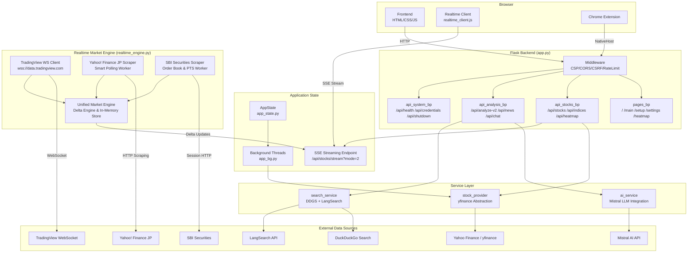
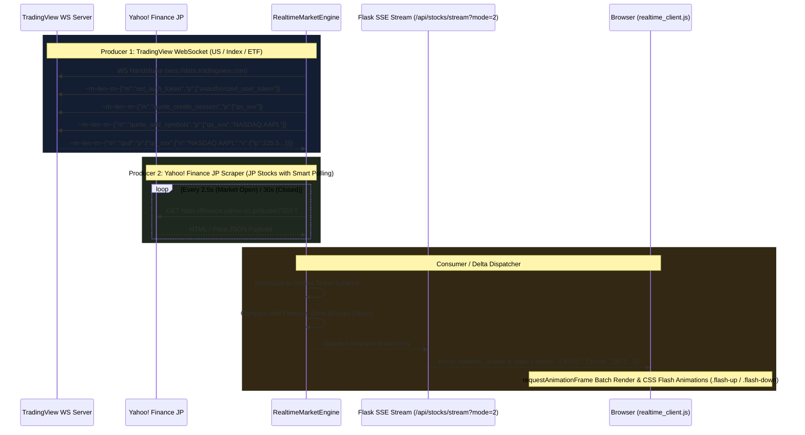
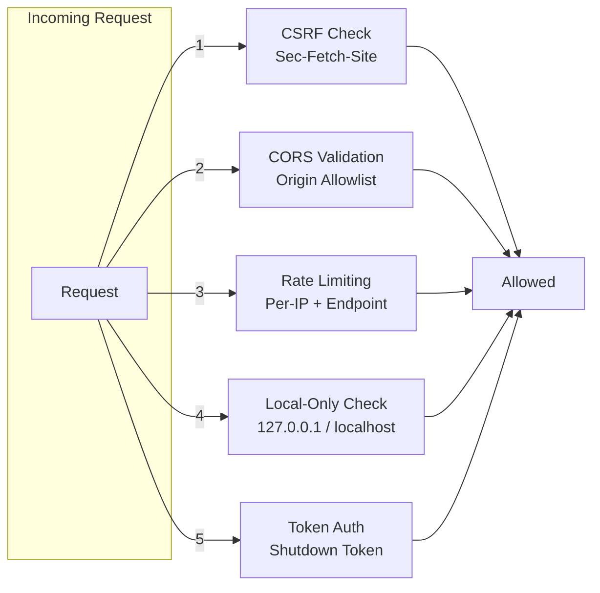

# Architecture Overview

## System Architecture


```mermaid
graph TB
    subgraph Browser["Browser"]
        FE[Frontend<br/>HTML/CSS/JS]
        RTC[Realtime Client<br/>realtime_client.js]
        CE[Chrome Extension]
    end

    subgraph Backend["Flask Backend (app.py)"]
        direction TB
        MW[Middleware<br/>CSP/CORS/CSRF/RateLimit]
        BP1[pages_bp<br/>/ /main /setup /settings /heatmap]
        BP2[api_stocks_bp<br/>/api/stocks /api/indices /api/heatmap]
        BP3[api_analysis_bp<br/>/api/analyze-v2 /api/news /api/chat]
        BP4[api_system_bp<br/>/api/health /api/credentials /api/shutdown]
    end

    subgraph RealtimeEngine["Realtime Market Engine (realtime_engine.py)"]
        TVWS[TradingView WS Client<br/>wss://data.tradingview.com]
        YJPS[Yahoo! Finance JP Scraper<br/>Smart Polling Worker]
        SBIS[SBI Securities Scraper<br/>Order Book & PTS Worker]
        UME[Unified Market Engine<br/>Delta Engine & In-Memory Store]
    end

    subgraph Services["Service Layer"]
        AIS[ai_service<br/>Mistral LLM Integration]
        SSS[search_service<br/>DDGS + LangSearch]
        SP[stock_provider<br/>yfinance Abstraction]
    end

    subgraph State["Application State"]
        AS[AppState<br/>app_state.py]
        BG[Background Threads<br/>app_bg.py]
        SSE[SSE Streaming Endpoint<br/>/api/stocks/stream?mode=2]
    end

    subgraph External["External Data Sources"]
        TV[TradingView WebSocket]
        YJP[Yahoo! Finance JP]
        SBI[SBI Securities]
        MISTRAL[Mistral AI API]
        YF[Yahoo Finance / yfinance]
        DDGS[DuckDuckGo Search]
        LS[LangSearch API]
    end

    FE -->|HTTP| MW
    RTC -->|SSE Stream| SSE
    CE -->|NativeHost| MW
    MW --> BP1 & BP2 & BP3 & BP4
    BP3 --> AIS
    BP3 --> SSS
    BP2 --> SP
    BP2 --> SSE
    AIS --> MISTRAL
    SP --> YF
    SSS --> DDGS
    SSS --> LS

    TVWS -->|WebSocket| TV
    YJPS -->|HTTP Scraping| YJP
    SBIS -->|Session HTTP| SBI

    TVWS & YJPS & SBIS --> UME
    UME -->|Delta Updates| SSE
    BG --> SP
    AS --> BG
```

---

## Realtime Market Engine Architecture (sekai-kabuka.com Style)

個人利用環境において `sekai-kabuka.com` のようなサブ秒〜数秒単位のリアルタイム株価自動配信を実現するため、**Producer-Consumer パターン** を用いた `Realtime Market Engine` を構築しています。


```mermaid
sequenceDiagram
    participant TV as TradingView WS Server
    participant YJP as Yahoo! Finance JP
    participant Engine as RealtimeMarketEngine
    participant SSE as Flask SSE Stream (/api/stocks/stream?mode=2)
    participant Client as Browser (realtime_client.js)

    rect rgb(20, 30, 50)
        Note over TV, Engine: Producer 1: TradingView WebSocket (US / Index / ETF)
        Engine->>TV: WS Handshake (wss://data.tradingview.com)
        Engine->>TV: ~m~len~m~{"m":"set_auth_token","p":["unauthorized_user_token"]}
        Engine->>TV: ~m~len~m~{"m":"quote_create_session","p":["qs_xxx"]}
        Engine->>TV: ~m~len~m~{"m":"quote_add_symbols","p":["qs_xxx","NASDAQ:AAPL"]}
        TV-->>Engine: ~m~len~m~{"m":"qsd","p":["qs_xxx",{"n":"NASDAQ:AAPL","v":{"lp":225.5...}}]}
    end

    rect rgb(30, 40, 30)
        Note over YJP, Engine: Producer 2: Yahoo! Finance JP Scraper (JP Stocks with Smart Polling)
        loop Every 2.5s (Market Open) / 30s (Closed)
            Engine->>YJP: GET https://finance.yahoo.co.jp/quote/7203.T
            YJP-->>Engine: HTML / Price JSON Payload
        end
    end

    rect rgb(50, 40, 20)
        Note over Engine, Client: Consumer / Delta Dispatcher
        Engine->>Engine: Normalize to Unified Ticker Schema
        Engine->>Engine: Compare with Previous Store (Extract Deltas)
        Engine-->>SSE: Dispatch changed tickers only
        SSE-->>Client: event: realtime_update \n data: {"deltas": {"AAPL": {"price": 225.5...}}}
        Note over Client: requestAnimationFrame Batch Render & CSS Flash Animations (.flash-up / .flash-down)
    end
```

### 1. Data Collection Layer (Producers)

- **TradingView WebSocket Client (`TradingViewWSClient`)**:
  - `wss://data.tradingview.com/socket.io/websocket` のプロトコルに準拠。
  - `~m~<length>~m~<json_payload>` のメッセージフレーミングを解析・エンコード。
  - セッション構築 (`quote_create_session`), フィールド指定 (`quote_set_fields`), 銘柄登録 (`quote_add_symbols`), `~h~` 心拍パケット応答を実施。
  - 切断時は指数バックオフ（最大30秒）で自動再接続。
- **Yahoo! Finance JP Scraper (`YahooJPRealtimeScraper`)**:
  - 東証取引時間中（平日 09:00-11:30 / 12:30-15:30 JST）は **2.5秒間隔のスマートポーリング**、場外は30秒間隔へ動的減速。
  - HTTP/2 (`httpx` / `requests`) と User-Agent ローテーションで安定抽出。
- **SBI Securities Scraper (`SBISecuritiesScraper`)**:
  - セッション維持型の気配値・PTS（夜間取引）データ補完。

### 2. Aggregation & Delta Engine (`RealtimeMarketEngine`)

- **Unified Ticker Schema**: 収集元によらずデータを以下の統一辞書構造に正規化。
  ```json
  {
    "symbol": "AAPL",
    "price": 225.5,
    "change": 1.5,
    "change_percent": 0.67,
    "volume": 45210000,
    "source": "tradingview",
    "updated_at": 1722887700.12
  }
  ```
- **Delta Packet Extraction**: 前回と価格や前日比に変化があった銘柄のみをパケット化。データ転送量を大幅に削減。

### 3. Streaming & UI Rendering Layer

- **Conditional SSE Dispatching**: Mode 2 (`sse_mode == 2`, TV連携リアルタイムモード) 接続時のみ `/api/stocks/stream` から `realtime_update` イベントをプッシュ出力。
- **DOM Batch Render & Flash Highlights**:
  - `realtime_client.js` で受信し、`requestAnimationFrame` でバッチ描画。
  - 株価上昇時は `.flash-up` (緑発光)、下落時は `.flash-down` (赤発光) の CSS アニメーションを一時適用。

---

## 3-Stage SSE Streaming Modes

| モード     | 名称                 | 説明                                                 | リアルタイムエンジン連携   |
| :--------- | :------------------- | :--------------------------------------------------- | :------------------------- |
| **Mode 0** | Disabled             | SSEストリーミング停止（60秒間隔のHTTPポーリング）    | OFF                        |
| **Mode 1** | Complementary        | 標準SSE配信（バックグラウンド同期データの定期更新）  | OFF                        |
| **Mode 2** | TradingView Realtime | TV連携リアルタイムSSE配信（WS / スクレイピング統合） | **ON (`realtime_update`)** |

---

## Module Structure

| Module                         | Responsibility                                                              |
| ------------------------------ | --------------------------------------------------------------------------- |
| `app.py`                       | Flask app init, middleware, error handlers, blueprint registration          |
| `app_state.py`                 | Centralized state: AppState, AIState, MarketDataState, CacheState, SSE      |
| `app_bg.py`                    | Background threads: yfinance fetch loop, RealtimeMarketEngine startup       |
| `services/realtime_engine.py`  | **TradingView WS client, Yahoo JP scraper, SBI scraper, Unified Engine**    |
| `config_utils.py`              | Config file I/O, API key encryption (keyring/DPAPI)                         |
| `constants.py`                 | Single source of truth for all tunable parameters                           |
| `route_helpers.py`             | Rate limiting, API key extraction, cache helpers                            |
| `error_codes.py`               | ErrorCode enum with ja/en messages                                          |
| `routes/`                      | Blueprint route handlers (`api_stocks.py` handles SSE stream mode 2)        |
| `services/`                    | External service integrations (AI, search, stock provider, realtime engine) |
| `utils/`                       | Validators, formatters, env helpers                                         |
| `static/js/realtime_client.js` | **Realtime SSE listener, DOM delta renderer, CSS flash highlighter**        |
| `static/js/`                   | Frontend JavaScript (SSE, charts, UI, API client)                           |
| `templates/`                   | Jinja2 HTML templates                                                       |
| `chrome_extension/`            | Chrome/Edge extension (MV3)                                                 |
| `native_host/`                 | Windows native messaging host                                               |

---

## Security Model


```mermaid
graph LR
    subgraph Incoming["Incoming Request"]
        R[Request]
    end

    R -->|1| CSRF[CSRF Check<br/>Sec-Fetch-Site]
    R -->|2| CORS[CORS Validation<br/>Origin Allowlist]
    R -->|3| RL[Rate Limiting<br/>Per-IP + Endpoint]
    R -->|4| LOCAL[Local-Only Check<br/>127.0.0.1 / localhost]
    R -->|5| TOKEN[Token Auth<br/>Shutdown Token]

    CSRF --> OK[Allowed]
    CORS --> OK
    RL --> OK
    LOCAL --> OK
    TOKEN --> OK
```

---

## Key Design Decisions

1. **Personal Use First**: Designed for local/localhost use, not multi-tenant SaaS.
2. **Multi-Source Realtime Streaming**: TradingView WS + Yahoo JP / SBI scraping integrated into a unified pipeline.
3. **Delta Encoding for SSE**: Sends only changed ticker attributes to conserve network & render overhead.
4. **Graceful Degradation**: Smart polling slows down outside market hours; automatic WS reconnection.
5. **Encrypted Credentials**: keyring > DPAPI for sensitive API tokens.
